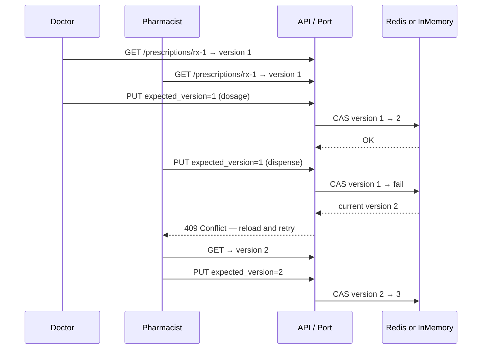

# Prescription updates: preventing doctor / pharmacist race conditions

Two clinicians updating the same prescription at the same time can cause **lost updates** if each reads stale data and saves over the other.

This repo uses **optimistic concurrency control**: every prescription has a monotonic `version`. Writers must send the version they read; the store applies the change only if that version still matches.

## Flow



## Try it (pure-php)

```bash
cd pure-php

# Create prescription (version 1)
php bin/console --in-memory prescription:create rx-demo patient-1 Amoxicillin 500mg

# Doctor update (1 → 2)
php bin/console --in-memory prescription:update rx-demo \
  '{"actor":"doctor","expected_version":1,"dosage":"500mg TID","status":"active"}'

# Pharmacist with stale version 1 → ConcurrentUpdateException in CLI
php bin/console --in-memory prescription:update rx-demo \
  '{"actor":"pharmacist","expected_version":1,"status":"dispensed"}' || true

# Reload version 2, then succeed (2 → 3)
php bin/console --in-memory prescription:get rx-demo
php bin/console --in-memory prescription:update rx-demo \
  '{"actor":"pharmacist","expected_version":2,"pharmacy_notes":"Counter 2","status":"dispensed"}'
```

## HTTP

```bash
USE_IN_MEMORY=1 composer serve

curl -s -X POST http://localhost:8080/prescriptions \
  -H 'Content-Type: application/json' \
  -d '{"prescription_id":"rx-1","patient_id":"patient-1","medication":"Amoxicillin","dosage":"500mg"}'

# Both actors read version 1, doctor writes first
curl -s -X PUT http://localhost:8080/prescriptions/rx-1 \
  -d '{"actor":"doctor","expected_version":1,"status":"active"}'

curl -s -X PUT http://localhost:8080/prescriptions/rx-1 \
  -d '{"actor":"pharmacist","expected_version":1,"status":"dispensed"}'
# → 409 with current_version: 2
```

## Role rules

| Role        | May update                                      |
|-------------|-------------------------------------------------|
| `doctor`    | `medication`, `dosage`, `instructions`, `status` (not → dispensed) |
| `pharmacist`| `pharmacy_notes`, `status` (not → draft)        |

Redis applies the version check atomically via `update_prescription.lua`.
